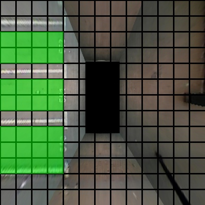
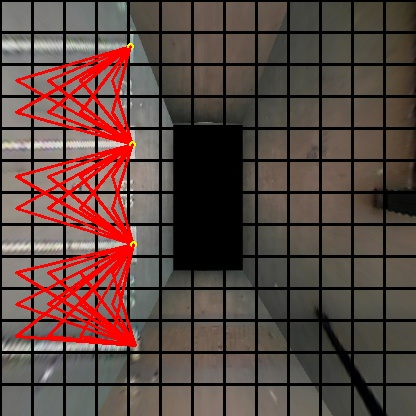
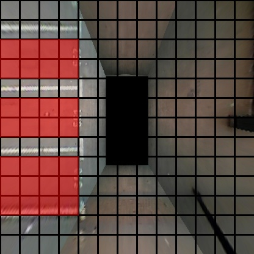
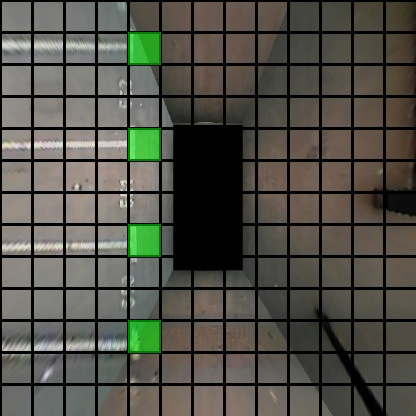
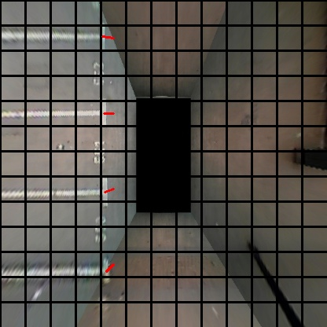
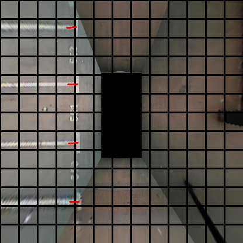

# ParkingSpaceDetection

This is the sample result of ParkingSpaceDetection in FishEyeImg and IPM Image.

# FishEyeImage

The sample result is as below:

# IPM Image

## Global Feature Map

 
 

  
   
  

## Local  Feature Map
 
 

  
   
  

## Result

We can get the parking space type,occupy,orient,and junc position.

